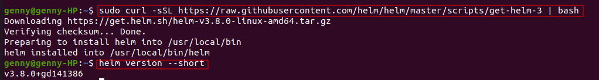
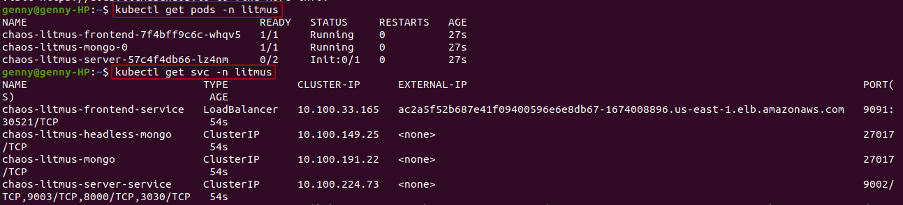

# Chaos-Engineering
### Chaos Engineering with LitmusChaos on Amazon EKS


As organizations are embracing microservices-based architectures by refactoring large monolith applications into smaller, independent, and loosely coupled services. These independent services are faster to deploy and scale, enabling organizations to innovate and deliver faster. Nevertheless,as the application grows, these microservices present their own challenges. 

For example, as you deploy tens or hundreds or thousands of microservices, operational tasks such as distributed tracing, debugging, testing, dependency mapping, and so on, become challenging. 

To address these challenges, organizations are increasingly practicing Chaos Engineering to test the reliability and performance of distributed systems.


#### What is Chaos Engineering?

Chaos Engineering is the discipline of experimenting on a system in order to build confidence in the system’s capability to withstand turbulent conditions in production.


#### Chaos Engineering in Practice

This practive follows 4 steps:

**1-** Start by defining ‘steady state’ as some measurable output of a system that indicates normal behavior.

**2-** Hypothesize that this steady state will continue in both the control group and the experimental group.

**3-** Introduce variables that reflect real world events like servers that crash, hard drives that malfunction, network connections that are severed, etc.

**4-** Try to disprove the hypothesis by looking for a difference in steady state between the control group and the experimental group.


### LitmusChaos Architecture

[LitmusChaos](https://litmuschaos.io/) is a cloud-native Chaos Engineering framework for Kubernetes. It is built using the [Kubernetes Operator framework](https://sdk.operatorframework.io/). A [Kubernetes Operator](https://kubernetes.io/docs/concepts/extend-kubernetes/operator/) is a software extension to Kubernetes that makes use of [custom resource definitions (CRDs)](https://kubernetes.io/docs/concepts/extend-kubernetes/api-extension/custom-resources/) to manage applications and their components.


Litmus takes a cloud-native approach to create, manage, and monitor chaos. Chaos is orchestrated using the following Kubernetes CRDs:

- **ChaosEngine**: A resource to link a Kubernetes application or Kubernetes node to a ChaosExperiment. ChaosEngine is watched by the Litmus ChaosOperator, which then invokes ChaosExperiments
- **ChaosExperiment**: A resource to group the configuration parameters of a chaos experiment. ChaosExperiment CRs are created by the operator when experiments are invoked by ChaosEngine.
- **ChaosResult**: A resource to hold the results of a ChaosExperiment.


For this project, I will create an Amazon EKS cluster with managed nodes. I’ll then install LitmusChaos and a demo application. After that, I will install chaos experiments to be run on the demo application and observe the behavior.


The followings are needed to complete the project:

- [AWS CLI version 2](https://docs.aws.amazon.com/cli/latest/userguide/install-cliv2.html)

Since I already installed the AWS CLI version 2 on my terminal from a previous project.  I simply check its version:


- [eksctl](https://docs.aws.amazon.com/eks/latest/userguide/eksctl.html)


- [kubectl](https://docs.aws.amazon.com/eks/latest/userguide/install-kubectl.html)

To install kubectl using native package management.  Type these commands below:


- [Helm](https://www.eksworkshop.com/beginner/060_helm/helm_intro/install/index.html)



### Step 1: Create EKS cluster

Steps to create a new EKS cluster

- Open your terminal and run these commands on it.


After running these commands on the terminal, navigate to AWS console and search for Amazon Elastic Kubernetes Service (EKS)


The cluster created on the terminal should appear as such:


When click on the cluster **eks-litmus-demo**, 2 nodes must show. If for any reason, there is no Node in there, need to add Nodes manually.

this link below will demonstrate how to manually Add Worker Nodes To Amazon EKS Cluster:

[How to add Nodes to EKS Cluster](https://ostechnix.com/add-worker-nodes-to-amazon-eks-cluster/)


These screenshots below will demostrate the steps of what I did to add the Worker Node to the EKS cluster


After I create the Amazon EKS cluster, I must configure my kubeconfig file with the AWS Command Line Interface (AWS CLI). This configuration allows me to connect to my cluster using the kubectl command line.

Here is the instructions link:
[Amazon EKS cluster using the kubectl command line](https://aws.amazon.com/premiumsupport/knowledge-center/eks-cluster-connection/)


- Verify that AWS CLI version 1.16.308 or greater is installed on your system:

```
$ aws --version
```
- Check the current identity to verify that I am using the correct credentials that have permissions for the Amazon EKS cluster:

```
aws sts get-caller-identity
```

- Create or update the kubeconfig file for your cluster:

```
aws eks --region region update-kubeconfig --name cluster_name
```

```
$ kubectl get pods --kubeconfig ./.kube/config
```


### Step 2: Install LitmusChaos

- Let’s install LitmusChaos on an Amazon EKS cluster using a Helm chart. The Helm chart will install the needed CRDs, service account configuration, and ChaosCenter.

- Add the Litmus Helm repository using the command below:


- This command below confirms that I have the Litmus-related Helm charts:


- Next, Let's Create a namespace to install LitmusChaos.


- By default, Litmus Helm chart creates NodePort services. Let’s change the backend service type to ClusterIP and front-end service type to LoadBalancer, so I can access the Litmus ChaosCenter using a load balancer.
  - I create a file on my PC and name it override-litmus.yaml. The, edit the override-litmus.yaml file and place the below code in it. 


- Install the chaos via by running the below command:


- The following commands will verify if LitmusChaos is running:




- To access Litmus ChaosCenter UI, let's use the URL given here

```http://ac2a5f52b687e41f09400596e6e8db67-1674008896.us-east-1.elb.amazonaws.com:9091```

and sign in using the default username “admin” and password “litmus.”


- Confirm the agent installation by running the command below.


- Verify that LitmusChaos CRDs are created:


- Verify that LitmusChaos API resources are created:


Now, I successfully install LitmusChaos on the EKS cluster. 


### Step 3: Install demo application

Let’s deploy nginx on the cluster using the manifest below to run the chaos experiments on it. Save the manifest as nginx.yaml and apply it.

- Create a file on your PC and name it nginx.yaml. Command to create that nginx.yaml is this :

 ```cat <<EOF> nginx.yaml```

Then edit **nginx.yaml** with the below code


- Install the demo app by running the below command on your terminal 


- Verify if the nginx pod is running by executing the command below.


